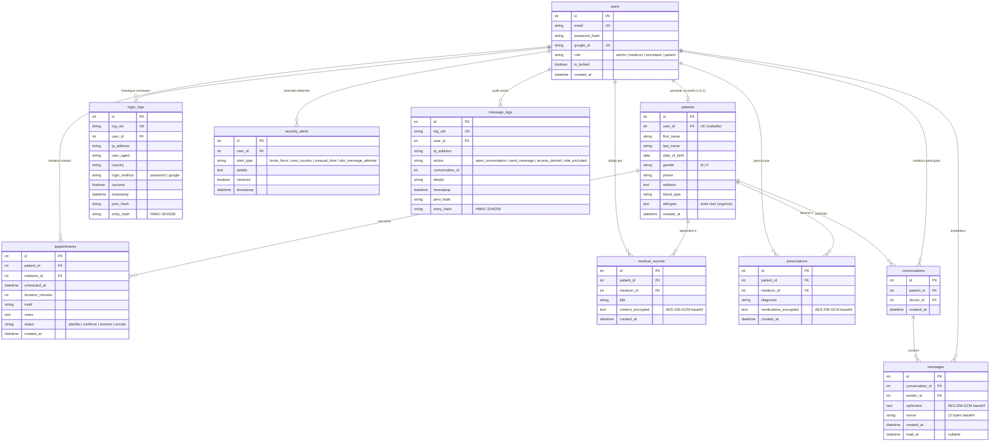

# Guide Complet du Projet MediCabinet
> **Application Flask de gestion de cabinet médical hautement sécurisée**  
> *Guide de compréhension, d'installation, d'évaluation technique et de soutenance orale.*

---

## Sommaire

1. [Présentation générale](#1-présentation-générale)
2. [Architecture et structure du projet](#2-architecture-et-structure-du-projet)
3. [Guide d'installation pas à pas](#3-guide-dinstallation-pas-à-pas)
4. [Fonctionnalités détaillées et catalogue des routes](#4-fonctionnalités-détaillées-et-catalogue-des-routes)
5. [Mesures de sécurité implémentées (Défense en profondeur)](#5-mesures-de-sécurité-implémentées-défense-en-profondeur)
6. [La Messagerie Sécurisée en détail](#6-la-messagerie-sécurisée-en-détail)
7. [Guide des tests automatisés (Pytest)](#7-guide-des-tests-automatisés-pytest)
8. [Guide de tests manuels pas à pas (Scénarios de validation)](#8-guide-de-tests-manuels-pas-à-pas-scénarios-de-validation)
9. [Audit et tests de sécurité avec Burp Suite](#9-audit-et-tests-de-sécurité-avec-burp-suite)
10. [Limites connues et axes d'amélioration](#10-limites-connues-et-axes-damélioration)
11. [Guide de dépannage (FAQ & Erreurs fréquentes)](#11-guide-de-dépannage-faq--erreurs-fréquentes)
12. [Glossaire des termes de cybersécurité](#12-glossaire-des-termes-de-cybersécurité)
13. [Annexe pour la soutenance orale](#13-annexe-pour-la-soutenance-orale)
14. [Points à vérifier](#14-points-à-vérifier)

---

## 1. Présentation générale

### 1.1 Objectif du projet
**MediCabinet** est une application web médicale développée en Python avec le micro-framework **Flask**.  
Elle vise à fournir un environnement complet de gestion de cabinet médical (dossiers patients, rendez-vous, ordonnances, messagerie directe) en appliquant les standards de **sécurité par conception (*Security by Design*)** et de **défense en profondeur**.

L'application traite des données de santé à caractère personnel hautement sensibles (RGPD / HDS), nécessitant un chiffrement fort au repos, une traçabilité infalsifiable des accès et un cloisonnement strict des privilèges.

---

### 1.2 Les 4 Rôles et la Matrice de Droits (RBAC)

L'application implémente un contrôle d'accès basé sur les rôles (**RBAC - Role-Based Access Control**) côté serveur :

| Rôle | Description | Droits autorisés | Restrictions strictes |
|---|---|---|---|
| **Administrateur** (`admin`) | Responsable technique et de sécurité de la plateforme | Accès complet au tableau de bord sécurité (`/admin`), gestion des comptes du personnel médical, consultation des logs de connexion, vérification de l'intégrité HMAC des logs, gestion des alertes de sécurité, suppression de dossiers médicaux / patients. | **Strictement exclu** de la messagerie médicale (`404`) pour préserver le secret médical. |
| **Médecin** (`medecin`) | Praticien de santé | Consultation de ses rendez-vous, création et consultation des dossiers médicaux et ordonnances chiffrés pour ses patients, messagerie chiffrée avec ses patients suivis. | Ne peut pas administrer les utilisateurs, ne peut pas voir les alertes de sécurité, ne peut pas écrire à des patients sans relation médicale. |
| **Secrétaire** (`secretaire`) | Personnel administratif d'accueil | Création et modification des fiches administratives patients (`/patients`), planification et mise à jour des rendez-vous (`/appointments`). | **Aucun accès** aux données cliniques chiffrées (dossiers, ordonnances), **aucun accès** à la messagerie (`404`), aucun accès à la zone d'administration. |
| **Patient** (`patient`) | Utilisateur final / Patient du cabinet | Consultation de ses propres rendez-vous, consultation de ses propres dossiers médicaux et ordonnances (déchiffrés pour lui), messagerie sécurisée avec ses praticiens. | **Aucun accès** aux données des autres patients (`403` ou `404`), aucun accès aux fonctions du personnel de santé (`staff`). |

---

## 2. Architecture et structure du projet

### 2.1 Arborescence commentée fichier par fichier

```text
cabinetmedical/
├── app.py                  # Point d'entrée de l'application : initialisation Flask, enregistrement des Blueprints, triggers SQLite anti-falsification et création de l'admin.
├── config.py               # Classe de configuration : chargement des variables d'environnement (.env), persistance de la clé AES-256.
├── models.py               # Définition des modèles SQLAlchemy (User, Patient, Appointment, MedicalRecord, Prescription, LoginLog, SecurityAlert, Conversation, Message, MessageLog).
├── auth.py                 # Blueprint d'authentification classique : inscription, politique de mot de passe fort, login avec protection brute-force, logout.
├── oauth.py                # Blueprint OAuth2 / OpenID Connect : intégration de la connexion "Continuer avec Google" via Authlib.
├── cabinet.py              # Blueprint métier : gestion des patients, planning des rendez-vous, dossiers médicaux et ordonnances chiffrés.
├── messages.py             # Blueprint de messagerie sécurisée : conversations patient-médecin, chiffrement AES-256-GCM avec AAD, polling AJAX, rate limiting.
├── decorators.py           # Décorateurs de contrôle d'accès côté serveur (@admin_required, @role_required, @staff_required, @owner_or_admin_required).
├── crypto_utils.py         # Boîte à outils cryptographiques : hachage HMAC-SHA256, tokens signés, chiffrement/déchiffrement AES-256-GCM avec ou sans AAD.
├── log_integrity.py        # Moteur d'intégrité des journaux d'audit : calcul du hash chaîné HMAC-SHA256 (style blockchain) pour LoginLog et MessageLog.
├── detection.py            # Moteur de détection d'anomalies de sécurité : brute-force, connexion depuis un nouveau pays, heure inhabituelle, levée d'alertes.
├── admin.py                # Blueprint d'administration : statistiques de sécurité, tableau des alertes, consultation et vérification de l'intégrité des logs, gestion des utilisateurs.
├── requirements.txt        # Liste des bibliothèques Python nécessaires au projet (Flask, SQLAlchemy, Bcrypt, Cryptography, Authlib, etc.).
├── .env.example            # Gabarit des variables d'environnement à renseigner.
├── .gitignore              # Règles d'exclusion Git (.env, secret_aes.key, app.db, caches).
├── static/
│   └── style.css           # Feuille de styles CSS Vanilla : design moderne, bulles de chat, dashboard responsive, dark sidebar.
├── templates/              # Templates HTML Jinja2 (22 fichiers) :
│   ├── base.html           # Squelette principal avec navigation adaptative selon le rôle et token CSRF global.
│   ├── index.html          # Page d'accueil publique avec modales de connexion et d'inscription.
│   ├── dashboard.html      # Tableau de bord utilisateur personnalisé selon le rôle (patient / secrétaire).
│   ├── patients.html       # Annuaire des patients avec barre de recherche (admin / secrétaire).
│   ├── patient_detail.html # Fiche patient détaillée avec historique médical et rendez-vous.
│   ├── patient_form.html   # Formulaire de création / édition de fiche patient.
│   ├── appointments.html   # Planning des rendez-vous filtrable par date.
│   ├── appointment_form.html# Formulaire de prise de rendez-vous avec détection de conflit de créneau.
│   ├── records.html        # Liste des dossiers médicaux d'un patient.
│   ├── record_form.html    # Formulaire de rédaction d'un dossier médical (chiffré à l'enregistrement).
│   ├── record_view.html    # Consultation déchiffrée d'un dossier médical.
│   ├── prescriptions.html  # Liste des ordonnances délivrées à un patient.
│   ├── prescription_form.html# Formulaire de prescription médicale (posologie chiffrée).
│   ├── prescription_view.html# Consultation déchiffrée d'une ordonnance.
│   ├── prescription_print.html# Vue d'impression papier sécurisée de l'ordonnance médicale.
│   ├── messages.html       # Liste des conversations de messagerie et démarrage d'un échange.
│   ├── message_chat.html   # Interface de discussion instantanée avec polling AJAX et chiffrement GCM.
│   ├── admin_index.html    # Vue d'ensemble administrateur avec indicateurs clés et graphiques.
│   ├── admin_alerts.html   # Console de gestion des alertes de sécurité avec acquittement.
│   ├── admin_logs.html     # Journal d'audit des connexions.
│   ├── admin_verify.html   # Rapport d'analyse cryptographique de la chaîne des logs.
│   └── admin_users.html    # Gestion des comptes utilisateurs (création staff, verrouillage de compte).
└── tests/
    ├── test_security.py    # 15 tests automatisés : authentification, RBAC, cryptographie AES/HMAC, résistance brute-force.
    └── test_messages.py    # 17 tests automatisés : chiffrement GCM en base, anti-IDOR, rate limiting, CSRF, échappement XSS, exclusion staff.
```

---

### 2.2 Technologies utilisées

- **Langage** : Python 3.9+ (testé sous Python 3.13)
- **Framework Web** : Flask 3.0.3
- **ORM & Base de données** : Flask-SQLAlchemy 3.1.1 avec moteur SQLite local (`app.db`)
- **Gestion des sessions** : Flask-Login 0.6.3
- **Hachage des mots de passe** : Flask-Bcrypt 1.0.1 (lib standard bcrypt C)
- **Cryptographie AEAD & HMAC** : Cryptography 43.0.1 (Hazmat primitives, AESGCM, HMAC-SHA256)
- **Client OAuth2 / OpenID Connect** : Authlib 1.3.2
- **Requêtes HTTP externes (Géolocalisation IP)** : Requests 2.32.3
- **Framework de tests** : Pytest 8.3.3

---

### 2.3 Schéma relationnel complet de la base de données



---

## 3. Guide d'installation pas à pas

### 3.1 Prérequis
- Système d'exploitation : Linux (Ubuntu/Debian), macOS ou Windows (avec WSL ou invite de commande).
- **Python 3.9** ou supérieur installé (`python3 --version`).
- Outil `pip` et module `venv` installés.

---

### 3.2 Installation pas à pas

#### Étape 1 : Ouvrir le terminal dans le dossier du projet
```bash
cd /chemin/vers/cabinetmedical
```

#### Étape 2 : Créer et activer l'environnement virtuel Python
```bash
# Création de l'environnement virtuel dans le dossier venv
python3 -m venv venv

# Activation (Linux / macOS)
source venv/bin/activate

# Activation sous Windows (PowerShell)
# .\venv\Scripts\Activate.ps1
```

#### Étape 3 : Installer les dépendances
```bash
pip install -r requirements.txt
```

#### Étape 4 : Configurer le fichier d'environnement `.env`
Copiez le gabarit `.env.example` vers `.env` :
```bash
cp .env.example .env
```

Générez des clés cryptographiques sécurisées grâce à la ligne de commande Python :
```bash
# Générer une clé secrète de 64 caractères hexadécimaux (32 octets)
python3 -c "import secrets; print(secrets.token_hex(32))"
```

Éditez `.env` et complétez les valeurs :
```dotenv
# Clé secrète Flask pour les sessions et la protection CSRF
SECRET_KEY=9f8e7d6c5b4a3928172635445566778899aabbccddeeff001122334455667788

# Clé secrète pour la signature HMAC des journaux d'audit et tokens
HMAC_SECRET=a1b2c3d4e5f67890123456789abcdef0123456789abcdef0123456789abcdef0

# URL de la base de données (SQLite par défaut)
DATABASE_URL=sqlite:///app.db

# Clé de chiffrement AES-256 (Optionnelle : si non renseignée, elle sera générée
# et sauvegardée automatiquement dans le fichier secret_aes.key)
ENCRYPTION_KEY_HEX=0123456789abcdef0123456789abcdef0123456789abcdef0123456789abcdef

# Identifiants Google OAuth2 (optionnels, laisser tel quel pour mode local sans Google)
GOOGLE_CLIENT_ID=dummy-client-id.apps.googleusercontent.com
GOOGLE_CLIENT_SECRET=dummy-secret
```

---

### 3.3 Premier lancement et récupération du compte Administrateur

Lancez le serveur Flask :
```bash
python3 app.py
```

Au tout premier démarrage :
1. SQLAlchemy crée l'ensemble des tables dans `app.db`.
2. Les triggers de protection SQLite anti-falsification sont automatiquement installés.
3. Si la clé AES n'est pas définie dans `.env`, `secret_aes.key` est généré avec 32 octets aléatoires.
4. Un compte administrateur est automatiquement provisionné, et son mot de passe temporaire unique est imprimé dans le terminal :

```text
============================================================
 Compte administrateur créé automatiquement :
   Email    : admin@medicabinet.fr
   Password : XyZ_98AbC12
 (à changer immédiatement après la première connexion)
============================================================
```

Rendez-vous ensuite sur **http://localhost:5000** dans votre navigateur.

---

## 4. Fonctionnalités détaillées et catalogue des routes

### 4.1 Authentification et Gestion de Session

- **Fichiers concernés** : [`auth.py`](file:///home/ameny/art_protection_secret/cabinetmedical/auth.py), [`models.py`](file:///home/ameny/art_protection_secret/cabinetmedical/models.py), [`detection.py`](file:///home/ameny/art_protection_secret/cabinetmedical/detection.py)
- **`POST /register`** : Inscription publique d'un patient. Valide l'adresse email, exige un mot de passe fort (≥12 caractères, majuscule, minuscule, chiffre), hache le mot de passe avec Bcrypt, crée un enregistrement `User(role="patient")` et son profil `Patient` lié.
- **`POST /login`** : Connexion par identifiants. Vérifie d'abord l'absence de blocage par brute-force via [`detection.check_brute_force`](file:///home/ameny/art_protection_secret/cabinetmedical/detection.py#L88-L111). Vérifie le mot de passe en temps constant avec `bcrypt.check_password_hash`. En cas de succès, initialise la session Flask-Login, journalise la tentative dans `login_logs` et déclenche [`detection.run_all_checks`](file:///home/ameny/art_protection_secret/cabinetmedical/detection.py#L135-L137) (détection d'heure inhabituelle et nouveau pays).
- **`GET /logout`** : Déconnexion sécurisée et destruction de la session utilisateur.

---

### 4.2 Connexion Google OAuth2 (OpenID Connect)

- **Fichiers concernés** : [`oauth.py`](file:///home/ameny/art_protection_secret/cabinetmedical/oauth.py), [`config.py`](file:///home/ameny/art_protection_secret/cabinetmedical/config.py)
- **`GET /auth/google/login`** : Redirige vers le serveur d'autorisation Google OAuth2 avec les portées `openid email profile`.
- **`GET /auth/google/callback`** : Reçoit le code d'autorisation, échange le jeton auprès de Google, récupère le profil vérifié (`sub`, `email`). Si le compte n'existe pas, crée un `User(role="patient")` avec son profil `Patient`. Connecte l'utilisateur sans mot de passe local.

---

### 4.3 Gestion administrative des Patients

- **Fichiers concernés** : [`cabinet.py`](file:///home/ameny/art_protection_secret/cabinetmedical/cabinet.py#L100-L219), [`templates/patients.html`](file:///home/ameny/art_protection_secret/cabinetmedical/templates/patients.html)
- **Accès** : `admin` et `secretaire` uniquement (`@role_required("admin", "secretaire")`).
- **`GET /patients`** : Annuaire des fiches administratives avec filtrage par nom/téléphone (`q`).
- **`GET/POST /patients/new`** : Création d'une fiche patient (nom, prénom, date de naissance, téléphone, adresse, groupe sanguin, allergies en clair). Possibilité de lier la fiche à un compte patient existant via `account_email`.
- **`GET /patients/<id>`** : Consultation détaillée (autorisé pour tout le personnel de santé via `@staff_required`).
- **`GET/POST /patients/<id>/edit`** : Mise à jour des coordonnées administratives.
- **`POST /patients/<id>/delete`** : Suppression définitive de la fiche patient (`admin` uniquement).

---

### 4.4 Prise et Suivi des Rendez-vous

- **Fichiers concernés** : [`cabinet.py`](file:///home/ameny/art_protection_secret/cabinetmedical/cabinet.py#L224-L315)
- **`GET /appointments`** : Planning des rendez-vous. Un patient ne voit que ses rendez-vous ; un médecin ne voit que les siens ; l'administration voit l'ensemble.
- **`GET/POST /appointments/new`** : Prise de rendez-vous (`admin` / `secretaire`). Contrôle anti-collision : empêche la planification simultanée de deux consultations pour le même médecin sur le même créneau horaire.
- **`POST /appointments/<id>/status`** : Mise à jour du statut (`planifie`, `confirme`, `termine`, `annule`) par le personnel (`@staff_required`).

---

### 4.5 Dossiers Médicaux Chiffrés (AES-256-GCM)

- **Fichiers concernés** : [`cabinet.py`](file:///home/ameny/art_protection_secret/cabinetmedical/cabinet.py#L321-L391), [`crypto_utils.py`](file:///home/ameny/art_protection_secret/cabinetmedical/crypto_utils.py)
- **`GET /patients/<id>/records`** : Liste des dossiers d'un patient. Le patient ne peut voir que les siens (contrôlé par `_check_patient_access`).
- **`GET/POST /patients/<id>/records/new`** : Création d'un dossier médical par un praticien (`medecin` ou `admin`). Le texte clinique saisi est chiffré avec la clé AES-256 du cabinet avant stockage dans la colonne `content_encrypted`.
- **`GET /records/<id>`** : Déchiffrement et affichage du dossier clinique. Si la clé est corrompue, un message d'erreur d'intégrité est affiché.
- **`POST /records/<id>/delete`** : Suppression autorisée uniquement pour l'administrateur ou le médecin auteur.

---

### 4.6 Ordonnances Médicales Chiffrées et Impression

- **Fichiers concernés** : [`cabinet.py`](file:///home/ameny/art_protection_secret/cabinetmedical/cabinet.py#L397-L458), [`templates/prescription_print.html`](file:///home/ameny/art_protection_secret/cabinetmedical/templates/prescription_print.html)
- **`GET /patients/<id>/prescriptions`** : Liste des prescriptions d'un patient.
- **`GET/POST /patients/<id>/prescriptions/new`** : Rédaction d'une ordonnance avec diagnostic en clair et posologie chiffrée en AES-256-GCM (`medications_encrypted`).
- **`GET /prescriptions/<id>`** : Consultation déchiffrée de la prescription.
- **`GET /prescriptions/<id>/print`** : Mise en page dédiée pour impression papier ou génération PDF conforme.

---

### 4.7 Administration et Console de Sécurité

- **Fichiers concernés** : [`admin.py`](file:///home/ameny/art_protection_secret/cabinetmedical/admin.py), [`log_integrity.py`](file:///home/ameny/art_protection_secret/cabinetmedical/log_integrity.py)
- **Accès** : `admin` exclusivement (`@admin_required`).
- **`GET /admin/`** : Tableau de bord de sécurité (volume de connexions, alertes ouvertes, graphiques par type d'incident).
- **`GET /admin/alerts`** : Liste des alertes de sécurité générées automatiquement par le moteur de détection.
- **`POST /admin/alerts/<id>/resolve`** : Acquittement d'une alerte par l'administrateur.
- **`GET /admin/logs`** : Consultation des 200 dernières tentatives de connexion.
- **`GET /admin/logs/verify`** : Algorithme de vérification mathématique de la chaîne de hachage HMAC-SHA256 de tous les logs. Identifie précisément si une ligne a été modifiée ou supprimée.
- **`GET /admin/users`** : Liste de tous les comptes de l'application.
- **`POST /admin/users/create`** : Création sécurisée de comptes pour le personnel (`medecin`, `secretaire`, `admin`).
- **`POST /admin/users/<id>/toggle_lock`** : Verrouillage immédiat d'un compte suspect.

---

## 5. Mesures de sécurité implémentées (Défense en profondeur)

Le tableau ci-dessous synthétise chaque mécanisme de protection actif dans le projet :

| Mesure de sécurité | Principe de fonctionnement | Fichier & Fonction | Menace contrecarrée |
|---|---|---|---|
| **Hachage Bcrypt** | Hachage adaptatif et salé avec coût computationnel élevé. | [`auth.py`](file:///home/ameny/art_protection_secret/cabinetmedical/auth.py#L65), [`models.py`](file:///home/ameny/art_protection_secret/cabinetmedical/models.py) | Fuite de base de données, attaques par dictionnaire et tables arc-en-ciel (*Rainbow Tables*). |
| **Comparaison en temps constant** | Utilisation de `hmac.compare_digest` et `bcrypt.check_password_hash`. | [`crypto_utils.py`](file:///home/ameny/art_protection_secret/cabinetmedical/crypto_utils.py#L49), [`auth.py`](file:///home/ameny/art_protection_secret/cabinetmedical/auth.py#L109) | Attaques par canal auxiliaire et analyse temporelle (*Timing Attacks*). |
| **Sécurité des Sessions** | Cookies de session configurés avec les attributs `HttpOnly`, `SameSite=Lax` et `Secure` configurable. | [`config.py`](file:///home/ameny/art_protection_secret/cabinetmedical/config.py#L46-L50) | Vol de cookie par injection JavaScript (XSS) et attaques Cross-Site Request Forgery (CSRF). |
| **RBAC côté serveur** | Vérification systématique du rôle de `current_user` par décorateurs Python avant exécution de la route. | [`decorators.py`](file:///home/ameny/art_protection_secret/cabinetmedical/decorators.py), [`messages.py`](file:///home/ameny/art_protection_secret/cabinetmedical/messages.py#L45-L65) | Élévation de privilèges horizontale et verticale. |
| **Protection Anti-CSRF** | Jeton aléatoire unique de 32 octets stocké en session et validé sur tous les `POST` (formulaires & en-têtes `X-CSRFToken`). | [`messages.py`](file:///home/ameny/art_protection_secret/cabinetmedical/messages.py#L34-L43), [`app.py`](file:///home/ameny/art_protection_secret/cabinetmedical/app.py#L30-L33) | Attaques CSRF (actions non sollicitées initiées depuis un site malveillant). |
| **Chiffrement AES-256-GCM + AAD** | Chiffrement symétrique authentifié avec clé 256 bits, nonce unique de 12 octets et données associées authentifiées. | [`crypto_utils.py`](file:///home/ameny/art_protection_secret/cabinetmedical/crypto_utils.py#L62-L105) | Lecture illégitime des données de santé au repos, altération de ciphertext, déplacement de messages entre conversations. |
| **Chaînage HMAC des Logs** | Chaque entrée de log intègre le hash de la précédente sous forme de HMAC-SHA256 secret. | [`log_integrity.py`](file:///home/ameny/art_protection_secret/cabinetmedical/log_integrity.py) | Falsification ou suppression silencieuse de traces d'audit par un attaquant (*Anti-forensics*). |
| **Triggers SQLite Append-Only** | Triggers `BEFORE UPDATE` et `BEFORE DELETE` levant une exception SQL `RAISE(ABORT)`. | [`app.py`](file:///home/ameny/art_protection_secret/cabinetmedical/app.py#L53-L122) | Modification ou suppression directe en base via injection SQL ou compromission du serveur. |
| **Détection d'Anomalies** | Analyse comportementale : brute-force (≥5 échecs / 5 min), nouveau pays de connexion (GeoIP), heure inhabituelle. | [`detection.py`](file:///home/ameny/art_protection_secret/cabinetmedical/detection.py) | Attaques par force brute, piratage de compte depuis l'étranger, accès hors heures normales. |
| **Rate Limiting** | Limitation stricte des messages à **20 envois par minute par utilisateur**. | [`messages.py`](file:///home/ameny/art_protection_secret/cabinetmedical/messages.py#L118-L125) | Déni de service applicatif (DoS), saturation de boîte de réception, spam. |
| **Anti-IDOR (404 systématique)** | Vérification que l'utilisateur connecté est strictement l'un des deux participants de la conversation. | [`messages.py`](file:///home/ameny/art_protection_secret/cabinetmedical/messages.py#L68-L106) | Référence directe à un objet non sécurisée (*Insecure Direct Object Reference*), fuite de données inter-patients. |
| **Protection Anti-XSS** | Échappement HTML automatique dans Jinja2 et insertion JavaScript exclusive par `textContent`. | [`templates/message_chat.html`](file:///home/ameny/art_protection_secret/cabinetmedical/templates/message_chat.html#L123) | Injection de scripts malveillants (*Cross-Site Scripting*). |
| **Requêtage exclusivement ORM** | Toutes les opérations utilisent SQLAlchemy avec requêtes paramétrées automatiques. | Tous les fichiers `.py` | Injections SQL (SQLi). |

---

## 6. La Messagerie Sécurisée en détail

### 6.1 Architecture et Chiffrement

La messagerie sécurisée permet des échanges confidentiels directs entre un patient et un médecin traitant :

```text
[Utilisateur A] --(Texte clair)--> [messages.py] --(AES-256-GCM + AAD: conv_id)--> [Base de données: Ciphertext + Nonce]
                                                                                              |
[Utilisateur B] <--(Texte clair)-- [messages.py] <--(Déchiffrement AES-GCM)-------------------+
```

- **Clé de chiffrement** : Clé AES-256 maîtresse (`ENCRYPTION_KEY`).
- **Nonce (Number used once)** : 12 octets aléatoires générés à chaque message (`os.urandom(12)`).
- **AAD (Associated Authenticated Data)** : L'identifiant de la conversation (`str(conversation_id).encode("utf-8")`) est injecté dans le calcul du tag d'authentification GCM. Si un attaquant tente de copier le ciphertext d'une conversation #1 vers une conversation #2, le déchiffrement échoue immédiatement avec une exception `InvalidTag`.

---

### 6.2 Règles d'éligibilité et d'autorisation

1. **Rôles autorisés** : Seuls les rôles `patient` et `medecin` ont accès au module. Les administrateurs et secrétaires reçoivent un code HTTP `404` immédiat.
2. **Initiation d'une conversation (`POST /messages/new`)** :
   - Un **patient** ne peut démarrer une conversation qu'avec un médecin avec lequel il possède un rendez-vous (`Appointment`), un dossier médical (`MedicalRecord`) ou une ordonnance (`Prescription`).
   - Un **médecin** ne peut écrire qu'à un patient avec lequel il a une relation médicale **ET** qui a activé un compte utilisateur (`patient.user_id is not None`).
3. **Contrôle d'accès à une conversation existante** :
   - Patient connecté : doit être le `patient_id` de la conversation (`conv.patient_id == current_user.patient_profile.id`).
   - Médecin connecté : doit être le `doctor_id` de la conversation (`conv.doctor_id == current_user.id`).
   - Toute violation IDOR : journalisée dans `message_logs`, déclenche une `SecurityAlert` et renvoie une `404` (anti-énumération).

---

## 7. Guide des tests automatisés (Pytest)

### 7.1 Exécution de la suite de tests

Lancez l'ensemble des tests automatisés avec le rapport détaillé :

```bash
# Dans le dossier cabinetmedical, avec l'environnement virtuel activé :
pytest tests/ -v
```

---

### 7.2 Tableau exhaustif des 32 tests de sécurité

La suite comporte **32 tests unitaires et d'intégration**, tous validés avec succès :

| Fichier | Nom du Test | Ce qu'il vérifie | Pourquoi c'est important |
|---|---|---|---|
| `test_messages.py` | `test_aes256_gcm_message_encryption_and_decryption` | Chiffre et déchiffre un message via AES-256-GCM avec AAD. | Valide l'intégrité de la cryptographie de bout en bout. |
| `test_messages.py` | `test_aes256_gcm_ciphertext_tampered_fails` | Altère 1 bit du ciphertext et vérifie la levée d'`InvalidTag`. | Prouve que toute modification de données chiffrées est détectée. |
| `test_messages.py` | `test_aes256_gcm_wrong_aad_fails` | Déchiffre avec un identifiant de conversation (AAD) différent. | Empêche le rejeu de messages entre différentes conversations. |
| `test_messages.py` | `test_message_stored_encrypted_in_db` | Envoie un message via l'API et inspecte la table `messages` en base. | Garantit qu'aucun texte clair n'est écrit sur le disque. |
| `test_messages.py` | `test_idor_other_patient_forbidden` | Un patient 2 tente de lire la conversation d'un patient 1 (renvoie `404`). | Empêche la violation de confidentialité inter-patients (IDOR). |
| `test_messages.py` | `test_idor_other_doctor_forbidden` | Un médecin 2 tente de lire la conversation d'un confrère (renvoie `404`). | Préserve le secret médical entre différents praticiens. |
| `test_messages.py` | `test_admin_and_secretaire_excluded_from_messages` | Admin et secrétaire tentent d'accéder à `/messages` (renvoie `404`). | Assure que le personnel technique/administratif ne lit pas les messages. |
| `test_messages.py` | `test_patient_cannot_start_conversation_without_relation` | Patient tente d'écrire à un médecin sans suivi préalable. | Empêche le démarchage ou les requêtes médicales non autorisées. |
| `test_messages.py` | `test_patient_can_start_conversation_with_appointment_or_record` | Patient avec rendez-vous initie un échange avec son médecin. | Valide le flux métier légitime. |
| `test_messages.py` | `test_doctor_cannot_contact_patient_without_user_account` | Médecin tente d'écrire à une fiche patient sans compte web associé. | Gère proprement l'absence de compte utilisateur destinataire. |
| `test_messages.py` | `test_missing_csrf_token_rejected` | Envoi d'un message `POST` sans jeton CSRF (rejet `400`). | Protège contre les attaques de falsification de requête inter-sites. |
| `test_messages.py` | `test_fetch_with_csrf_header_accepted` | Envoi d'un message AJAX avec l'en-tête `X-CSRFToken` (succès `201`). | Valide le fonctionnement fluide du chat en JavaScript. |
| `test_messages.py` | `test_empty_or_whitespace_message_rejected` | Envoi d'un message vide ou rempli d'espaces (rejet `400`). | Validation stricte des entrées utilisateur. |
| `test_messages.py` | `test_overlong_message_rejected` | Envoi d'un message excédant 2000 caractères (rejet `400`). | Prévient les attaques par déni de service et saturation de mémoire. |
| `test_messages.py` | `test_xss_is_escaped_in_rendered_html` | Envoi d'une charge utile `<script>alert(...)` et inspection du HTML. | Garantit l'échappement HTML anti-XSS strict par Jinja2. |
| `test_messages.py` | `test_rate_limiting_enforced` | Envoi de 21 messages consécutifs en moins d'une minute (21e = `429`). | Empêche le spam et les attaques automatisées par force brute. |
| `test_messages.py` | `test_polling_and_read_status` | Polling AJAX et basculement automatique du champ `read_at`. | Valide le suivi de lecture en temps réel. |
| `test_security.py` | `test_home_page` | Chargement de la page d'accueil `/`. | Disponibilité du service. |
| `test_security.py` | `test_login_page` | Redirection et affichage de la modale de connexion. | Bon fonctionnement du point d'accès d'authentification. |
| `test_security.py` | `test_register_page` | Redirection et affichage de la modale d'inscription. | Bon fonctionnement du point d'accès d'inscription. |
| `test_security.py` | `test_register_creates_patient_role` | Inscription d'un utilisateur et vérification de la création du rôle patient. | Cloisonnement par défaut des nouveaux inscrits. |
| `test_security.py` | `test_weak_password_rejected` | Inscription avec mot de passe trop court (`123`). | Application de la politique de sécurité des mots de passe. |
| `test_security.py` | `test_duplicate_email_rejected` | Tentative de création de deux comptes avec la même adresse email. | Intégrité et unicité des comptes utilisateurs. |
| `test_security.py` | `test_login_wrong_password` | Tentative de connexion avec un mot de passe incorrect. | Message d'erreur générique sans énumération. |
| `test_security.py` | `test_login_success_redirects` | Connexion valide redirigeant vers le tableau de bord. | Validation du flux de login légitime. |
| `test_security.py` | `test_rbac_patient_forbidden_from_staff_pages` | Un patient tente d'accéder à `/patients` et `/admin/` (`403`). | Vérifie l'étanchéité des privilèges RBAC. |
| `test_security.py` | `test_unauthenticated_redirected_from_dashboard` | Visiteur non authentifié tente d'accéder à `/dashboard`. | Protection des routes par `@login_required`. |
| `test_security.py` | `test_aes256_roundtrip` | Chiffrement et déchiffrement d'une note médicale en mémoire. | Conformité de l'algorithme AES-256-GCM. |
| `test_security.py` | `test_aes256_different_nonce_each_time` | Chiffre deux fois le même texte et compare les ciphertexts. | Prouve l'utilisation d'un vecteur d'initialisation aléatoire unique. |
| `test_security.py` | `test_hmac_token_valid` | Génère et vérifie un jeton signé HMAC-SHA256. | Authenticité et intégrité des jetons de réinitialisation. |
| `test_security.py` | `test_hmac_token_tampered` | Altère le payload d'un jeton HMAC et vérifie le rejet. | Détection de falsification de jetons signés. |
| `test_security.py` | `test_hmac_token_wrong_key` | Vérifie un token HMAC avec une mauvaise clé secrète. | Impossibilité de forger des signatures sans la clé. |

---

## 8. Guide de tests manuels pas à pas (Scénarios de validation)

### 8.1 Préparation des comptes de test
Pour tester manuellement l'ensemble des scénarios, lancez l'application (`python3 app.py`) et connectez-vous avec le compte `admin@medicabinet.fr` généré dans la console. Créez ensuite les comptes suivants depuis l'interface `/admin/users` :

1. **Médecin 1** : `docteur.martin@medicabinet.fr` / `Motdepasse1234` (Rôle : `medecin`)
2. **Médecin 2** : `docteur.dupont@medicabinet.fr` / `Motdepasse1234` (Rôle : `medecin`)
3. **Secrétaire** : `secretaire@medicabinet.fr` / `Motdepasse1234` (Rôle : `secretaire`)
4. **Patient 1** : Inscription publique via la page d'accueil avec `patient.alice@gmail.com` / `Motdepasse1234` (Alice Martin)
5. **Patient 2** : Inscription publique avec `patient.bob@gmail.com` / `Motdepasse1234` (Bob Dupont)

---

### 8.2 Scénarios pas à pas

#### Scénario 1 : Politique de mot de passe à l'inscription
- **Action** : Sur la page d'accueil `/`, tentez de créer un compte avec le mot de passe `azerty`.
- **Résultat attendu** : Rejet immédiat avec message flash : *"Le mot de passe doit contenir au moins 12 caractères, une majuscule, une minuscule et un chiffre."*
- **Ce que ça prouve** : Respect de la politique de complexité des mots de passe.

#### Scénario 2 : Détection de force brute (Brute-Force)
- **Action** : Exécutez dans le terminal 6 tentatives de connexion erronées consécutives :
  ```bash
  for i in {1..6}; do
    curl -i -X POST http://localhost:5000/login -d "email=patient.alice@gmail.com&password=FauxMotDePasse123"
  done
  ```
- **Résultat attendu** : À la 6e tentative, le serveur répond avec un blocage. En vous connectant en administrateur sur `/admin/alerts`, une alerte `brute_force` apparaît.
- **Ce que ça prouve** : Le moteur de détection d'anomalies isole et trace les attaques par force brute.

#### Scénario 3 : Cloisonnement des rôles (RBAC)
- **Action** : Connectez-vous avec `patient.alice@gmail.com` et tentez d'accéder directement à l'URL `http://localhost:5000/admin` puis `http://localhost:5000/patients`.
- **Résultat attendu** : Code d'erreur `403 Forbidden` sur les deux URLs.
- **Ce que ça prouve** : Le décorateur `@role_required` bloque toute élévation de privilèges.

#### Scénario 4 : Dossier médical chiffré en base de données
- **Action** : 
  1. En tant que `secretaire@medicabinet.fr`, planifiez un rendez-vous entre `docteur.martin@medicabinet.fr` et Alice Martin.
  2. Connectez-vous en `docteur.martin@medicabinet.fr`, ouvrez la fiche d'Alice et créez un dossier médical intitulé *"Bilan Cardiaque"* avec le contenu *"Patient présente une légère arythmie bénigne."*
  3. Inspectez directement le contenu du fichier `app.db` dans le terminal :
     ```bash
     sqlite3 app.db "SELECT id, title, content_encrypted FROM medical_records;"
     ```
- **Résultat attendu** : La commande affiche le titre en clair, mais la colonne `content_encrypted` contient une chaîne illisible en base64 (ex: `A8f9j2l...`). Le terme *"arythmie"* n'apparaît nulle part en clair dans le fichier `.db`.
- **Ce que ça prouve** : Chiffrement symétrique AES-256-GCM effectif au repos.

#### Scénario 5 : Messagerie sécurisée normale
- **Action** :
  1. Connectez-vous avec `patient.alice@gmail.com`, cliquez sur **💬 Messagerie** dans la barre latérale.
  2. Sélectionnez le Dr. Martin et envoyez : *"Bonjour Docteur, tout va bien."*
  3. Connectez-vous en `docteur.martin@medicabinet.fr` sur `/messages` : la conversation s'affiche avec un badge non-lu. Ouvrez-la : le message apparaît déchiffré et passe en statut lu (`✓✓`).
- **Résultat attendu** : Échange fluide et transparent pour les deux parties autorisées.

#### Scénario 6 : Tentative d'accès non autorisé à une conversation (IDOR)
- **Action** :
  1. Notez l'ID de la conversation d'Alice et du Dr. Martin (ex: `/messages/1`).
  2. Connectez-vous avec le compte de Bob (`patient.bob@gmail.com`) ou du Dr. Dupont (`docteur.dupont@medicabinet.fr`).
  3. Tentez d'accéder directement à `http://localhost:5000/messages/1`.
- **Résultat attendu** : Code `404 Not Found`. Connectez-vous en `admin` sur `/admin/alerts` : une alerte de type `idor_message_attempt` a été générée avec les détails de la tentative.
- **Ce que ça prouve** : Protection anti-IDOR avec alerte proactive et anti-énumération.

#### Scénario 7 : Exclusion absolue de l'administrateur et de la secrétaire
- **Action** : En étant connecté avec `admin@medicabinet.fr` ou `secretaire@medicabinet.fr`, tentez d'ouvrir `http://localhost:5000/messages` ou `http://localhost:5000/messages/1`.
- **Résultat attendu** : Réponse `404 Not Found`.
- **Ce que ça prouve** : Respect strict du secret médical, même vis-à-vis des comptes privilégiés.

#### Scénario 8 : Protection Anti-XSS dans la messagerie
- **Action** : Depuis le compte d'Alice, envoyez le message :
  ```html
  <script>alert('PIRATAGE')</script><b>Test XSS</b>
  ```
- **Résultat attendu** : Aucune boîte de dialogue JavaScript ne s'affiche. Le texte s'affiche littéralement sous forme de texte brut échappé dans la bulle.
- **Ce que ça prouve** : Échappement HTML automatique dans Jinja2 et insertion DOM par `textContent` en JavaScript.

#### Scénario 9 : Rejet d'un message sans jeton CSRF
- **Action** : Tentez d'envoyer un message via `curl` sans jeton CSRF :
  ```bash
  curl -i -X POST http://localhost:5000/messages/1/send -d "content=AttaqueCSRF"
  ```
- **Résultat attendu** : Rejet avec le code HTTP `400 Bad Request` (*Token CSRF manquant ou invalide*).
- **Ce que ça prouve** : Toutes les modifications d'état exigent un jeton de session cryptographiquement authentifié.

#### Scénario 10 : Triggers SQLite anti-suppression (Append-Only)
- **Action** : Tentez de purger directement la table des logs ou des alertes en exécutant :
  ```bash
  sqlite3 app.db "DELETE FROM login_logs;"
  sqlite3 app.db "DELETE FROM message_logs;"
  ```
- **Résultat attendu** : SQLite renvoie l'erreur :
  `Error: login_logs est en lecture seule (append-only)`
  `Error: message_logs est en lecture seule (append-only)`
- **Ce que ça prouve** : Les triggers SQLite interdisent toute altération des journaux d'audit même en cas d'accès SQL direct.

#### Scénario 11 : Vérification de l'intégrité cryptographique des logs
- **Action** : Connectez-vous en `admin` et accédez à `/admin/logs/verify`.
- **Résultat attendu** : L'interface affiche un badge vert : *"Intégrité validée : 100% des logs sont conformes et la chaîne HMAC est intacte."*
- **Ce que ça prouve** : Capacité d'audit forensique mathématiquement prouvée.

---

## 9. Audit et tests de sécurité avec Burp Suite

### 9.1 Configuration du Proxy Burp Suite
1. Démarrez Burp Suite Community Edition.
2. Dans **Proxy → Proxy Settings**, assurez-vous que le listener écoute sur `127.0.0.1:8080`.
3. Configurez votre navigateur pour router le trafic via le proxy HTTP `127.0.0.1:8080` (ou utilisez le navigateur intégré de Burp : **Proxy → Open Browser**).

---

### 9.2 Scénarios d'interception et résultats

#### A. Test d'injection SQL (SQLi)
- **Vecteur** : Interceptez la requête de connexion `POST /login` et modifiez le champ `email` :
  ```text
  email=admin%40medicabinet.fr'+OR+'1'%3D'1&password=test
  ```
- **Observation** : L'ORM SQLAlchemy traite la valeur comme une chaîne littérale échappée. La requête échoue proprement avec un message d'erreur générique `Email ou mot de passe incorrect`.

#### B. Test de manipulation d'IDOR
- **Vecteur** : Connectez-vous avec `patient.bob@gmail.com`. Interceptez la requête `GET /messages/1` (conversation d'Alice) et transmettez-la (**Forward**).
- **Observation** : Le serveur répond `404 Not Found` et une alerte de sécurité est enregistrée.

#### C. Test de fixation de session
- **Vecteur** : Observez la valeur du cookie `session` avant et après la connexion sur `POST /login`.
- **Observation** : Flask-Login regénère le cookie de session lors de l'authentification réussie, invalidant l'ancien identifiant anonyme.

#### D. Test de contournement CSRF
- **Vecteur** : Interceptez une requête `POST /messages/1/send`, supprimez l'en-tête `X-CSRFToken` et le champ `csrf_token` dans le corps.
- **Observation** : Le serveur renvoie immédiatement une erreur `400 Bad Request`.

---

## 10. Limites connues et axes d'amélioration

Dans une démarche d'ingénierie rigoureuse, les limites techniques actuelles et leurs solutions industrielles sont documentées ci-dessous :

| Fonctionnalité | Limite technique actuelle | Solution industrielle cible |
|---|---|---|
| **Stockage de la clé AES maîtresse** | La clé symétrique est stockée dans le fichier local `secret_aes.key` ou en variable d'environnement `.env`. Un administrateur système disposant d'un accès root au serveur pourrait théoriquement lire la clé en mémoire. | Déploiement d'un **HSM (Hardware Security Module)** ou service KMS cloud (AWS KMS, GCP Cloud KMS, HashiCorp Vault) pour la gestion et la rotation des clés. |
| **Chiffrement de la messagerie** | Chiffrement symétrique côté serveur (au repos). | Évolution vers un **chiffrement de bout en bout asymétrique (E2EE)** avec paires de clés X25519 / Signal Protocol générées et conservées exclusivement dans le navigateur client (Web Crypto API). |
| **Authentification multi-facteurs (2FA)** | L'application supporte le mot de passe classique et Google OAuth2, mais ne propose pas de second facteur TOTP intégré. | Intégration de `pyotp` pour générer et valider des codes 2FA (Google Authenticator / YubiKey WebAuthn). |
| **Moteur de base de données** | SQLite local (`app.db`). Idéal pour la démonstration et le développement, mais non adapté aux accès concurrents massifs en production. | Migration vers un SGBDR d'entreprise comme **PostgreSQL** avec chiffrement TDE (*Transparent Data Encryption*). |
| **Journalisation externe** | Les logs sont stockés dans la même base SQLite que l'application (protégés par HMAC et triggers). | Exportation en temps réel des journaux d'audit vers un **SIEM externe** (Splunk, Elastic SIEM) via protocole sécurisé Syslog TLS (stockage WORM). |

---

## 11. Guide de dépannage (FAQ & Erreurs fréquentes)

### Q1 : `sqlite3 app.db "SELECT ... FROM messages;"` renvoie `Error: no such table: messages`
- **Cause** : Le fichier `app.db` n'a pas encore été initialisé par Flask. Les tests automatisés `pytest` utilisent une base en mémoire volatile (`sqlite:///:memory:`).
- **Solution** : Lancez simplement l'application une première fois avec `python3 app.py`. SQLAlchemy exécutera `db.create_all()` et créera toutes les tables automatiquement.

### Q2 : `PermissionError: [Errno 13] Permission denied: 'secret_aes.key'`
- **Cause** : Le dossier de travail ou le fichier de clé a été créé par un autre utilisateur (ex: root).
- **Solution** : Réattribuez les droits à votre utilisateur courant :
  ```bash
  sudo chown -R $USER:$USER .
  ```

### Q3 : Le bouton "Continuer avec Google" renvoie une erreur
- **Cause** : Les identifiants `GOOGLE_CLIENT_ID` et `GOOGLE_CLIENT_SECRET` dans votre fichier `.env` sont des valeurs fictives.
- **Solution** : L'application fonctionne parfaitement en mode classique (email/mot de passe). Pour activer Google, suivez les instructions de création d'ID client OAuth2 dans la console Google Cloud et renseignez le fichier `.env`.

### Q4 : `Address already in use` lors du lancement de `app.py`
- **Cause** : Le port 5000 est déjà occupé par un autre processus ou une ancienne instance de Flask.
- **Solution** : Libérez le port 5000 :
  ```bash
  lsof -ti:5000 | xargs kill -9
  ```

---

## 12. Glossaire des termes de cybersécurité

- **RBAC (Role-Based Access Control)** : Modèle de contrôle d'accès où les permissions sont associées à des rôles (`admin`, `medecin`, `secretaire`, `patient`) plutôt qu'à des individus.
- **AES-256-GCM (Galois/Counter Mode)** : Algorithme de chiffrement symétrique standardisé offrant à la fois la **confidentialité** (chiffrement par blocs de 256 bits) et l'**authenticité** (tag d'intégrité calculé par multiplication dans un corps de Galois).
- **AAD (Additional Authenticated Data)** : Données associées non chiffrées mais incluses dans le calcul du tag d'intégrité cryptographique d'AES-GCM (ici le `conversation_id`), empêchant toute altération de contexte.
- **Nonce (Number used once)** : Valeur numérique aléatoire ou séquentielle qui ne doit être utilisée qu'une seule et unique fois avec une clé donnée afin de garantir que deux chiffrements d'un même texte produisent des résultats distincts.
- **HMAC (Hash-based Message Authentication Code)** : Mécanisme d'authentification de message combinant une fonction de hachage cryptographique (SHA-256) et une clé secrète partagée.
- **IDOR (Insecure Direct Object Reference)** : Vulnérabilité par laquelle une application fournit un accès direct à des objets sur la base d'identifiants fournis par l'utilisateur sans contrôle d'autorisation suffisant.
- **CSRF (Cross-Site Request Forgery)** : Attaque consistant à transmettre des commandes non autorisées depuis un site tiers de confiance où l'utilisateur est authentifié.
- **XSS (Cross-Site Scripting)** : Injection de code JavaScript malveillant dans des pages web consultées par d'autres utilisateurs.
- **Bcrypt** : Fonction de dérivation de clé pour mots de passe basée sur le chiffrement Blowfish, intégrant un sel aléatoire et un coût d'itération ajustable pour résister aux attaques matérielles (GPU/ASIC).
- **Append-Only** : Propriété d'une structure de données ou d'une table dans laquelle les enregistrements ne peuvent être qu'ajoutés, sans possibilité de modification ou de suppression.

---

## 13. Annexe pour la soutenance orale

### 13.1 Pitch du projet en 10 lignes (Introduction du candidat)
> *"MediCabinet est une application médicale sécurisée développée en Python/Flask, conçue selon le principe de défense en profondeur. Elle répond aux exigences strictes de confidentialité des données de santé en combinant un contrôle d'accès strict basé sur 4 rôles (RBAC), le hachage robuste des mots de passe en Bcrypt, et le chiffrement symétrique authentifié AES-256-GCM avec données associées (AAD) pour les dossiers cliniques et la messagerie instantanée. Les rôles administratifs et secrétariat sont strictement exclus des échanges médicaux pour garantir le secret professionnel. Afin de parer aux tentatives de falsification de preuves, l'application intègre une détection proactive d'anomalies, des triggers SQLite append-only et une chaîne de logs d'audit scellée par HMAC-SHA256. L'ensemble de l'architecture est validé par une suite de 32 tests de sécurité automatisés."*

---

### 13.2 10 Questions probables du jury et réponses percutantes

1. **Q : Pourquoi avoir choisi AES-GCM plutôt qu'AES-CBC ?**  
   *R : AES-GCM est un mode AEAD (Authenticated Encryption with Associated Data). Contrairement à CBC qui nécessite un HMAC séparé (Encrypt-then-MAC) et reste vulnérable aux attaques par oracle de remplissage (Padding Oracle), GCM garantit simultanément la confidentialité et l'authenticité des données.*

2. **Q : À quoi sert le paramètre AAD dans votre messagerie ?**  
   *R : Nous lions le `conversation_id` comme AAD lors du chiffrement. Si un attaquant déplace un ciphertext d'une conversation vers une autre dans la base de données, la clé ne pourra pas le déchiffrer car le tag d'intégrité sera invalide.*

3. **Q : Pourquoi l'administrateur reçoit-il une erreur 404 sur `/messages` plutôt qu'une 403 ?**  
   *R : Pour des raisons de secret médical et d'anti-énumération. Renvoyer une 404 masque l'existence même des ressources de messagerie aux comptes d'infrastructure et décourage les attaquants.*

4. **Q : Comment garantissez-vous qu'un attaquant avec accès root ne modifie pas les logs ?**  
   *R : Les triggers SQLite bloquent les `UPDATE` et `DELETE` via SQL. De plus, chaque entrée est chaînée cryptographiquement par HMAC-SHA256. Une altération romprait la chaîne mathématique, ce qui est immédiatement mis en évidence lors de la vérification sur `/admin/logs/verify`.*

5. **Q : Quelle est la limite principale de votre gestion de clé AES ?**  
   *R : La clé est stockée localement sur le serveur applicatif. En environnement de production hospitalière, nous préconisons l'intégration d'un HSM (Hardware Security Module) ou d'un KMS cloud pour isoler la clé de la mémoire du serveur.*

6. **Q : Comment protégez-vous l'application contre les attaques XSS dans le chat ?**  
   *R : Deux niveaux de défense : Jinja2 échappe par défaut toutes les variables HTML (aucun filtre `|safe` n'est utilisé), et le script JavaScript insère les messages déchiffrés dans le DOM uniquement via la propriété `textContent`, neutralisant toute interprétation de balise `<script>`.*

7. **Q : Comment fonctionne la détection de force brute ?**  
   *R : Avant d'évaluer les identifiants saisis, la fonction `check_brute_force` compte les échecs récents pour l'utilisateur ou l'IP sur une fenêtre glissante de 5 minutes. Dès 5 échecs, une `SecurityAlert` est persistée et la requête est rejetée.*

8. **Q : Pourquoi avoir combiné un token CSRF et des cookies SameSite ?**  
   *R : C'est une application du principe de défense en profondeur. `SameSite=Lax` protège la navigation standard, tandis que le token CSRF validé par `hmac.compare_digest` protège les requêtes asynchrones `fetch` et les contextes où les règles de cookies peuvent varier.*

9. **Q : Un patient peut-il initier une conversation avec n'importe quel médecin ?**  
   *R : Non. La fonction `can_communicate` vérifie obligatoirement l'existence d'une relation clinique préalable (au moins un rendez-vous, un dossier médical ou une ordonnance existante).*

10. **Q : Comment gérez-vous le rate limiting sur la messagerie ?**  
    *R : Le serveur interroge la table `messages` pour vérifier qu'un utilisateur n'a pas émis plus de 20 messages dans la dernière minute. Au-delà, une réponse HTTP `429 Too Many Requests` est renvoyée sans effectuer de calcul cryptographique coûteux.*

---

### 13.3 Plan de démonstration chronométré (5 minutes)

```text
[00:00 - 01:00] Inscription & Politique de sécurité :
  - Démonstration du rejet d'un mot de passe faible.
  - Inscription réussie d'Alice. Présentation de la sidebar et du rôle restreint.

[01:00 - 02:15] Prise en charge médicale & Chiffrement au repos :
  - Connexion Secrétaire : prise de rendez-vous pour Alice avec le Dr. Martin.
  - Connexion Dr. Martin : création d'un dossier médical chiffré.
  - Démonstration console : ouverture de SQLite pour prouver le stockage chiffré AES-256-GCM.

[02:15 - 03:30] Messagerie sécurisée & Anti-IDOR :
  - Discussion en direct entre Alice et le Dr. Martin avec rafraîchissement temps réel (polling).
  - Connexion de Bob : tentative d'accès à l'URL de la conversation d'Alice -> 404 immédiate.

[03:30 - 04:30] Console Administrateur & Intégrité des logs :
  - Connexion Admin : visualisation de l'alerte IDOR générée automatiquement par la tentative de Bob.
  - Démonstration de la vérification cryptographique des logs HMAC sur /admin/logs/verify.

[04:30 - 05:00] Conclusion & Lancement des tests automatisés :
  - Exécution de `pytest tests/ -v` dans le terminal montrant les 32 tests au vert.
```

---

## 14. Points à vérifier

- **Exécution SQLite locale** : Le fichier `app.db` est créé lors du premier lancement de `python3 app.py`. Si vous ouvrez `sqlite3 app.db` avant d'avoir démarré l'application, créez-le via `python3 app.py`.
- **Clé AES** : Assurez-vous que `secret_aes.key` reste bien protégé avec les permissions `600` ou `640` sur votre machine de déploiement et qu'il n'est jamais commité sur Git (confirmé dans `.gitignore`).
- **OAuth Google** : La fonctionnalité est entièrement implémentée dans le code, mais requiert des clés Google Cloud valides dans `.env` pour un fonctionnement réel en ligne.
